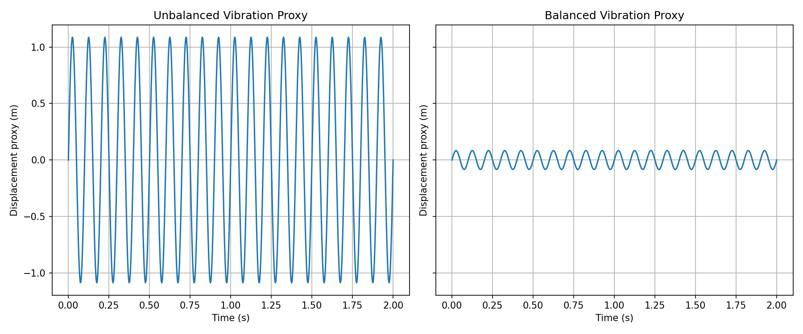

# Rotor-Imbalance-Simulator

`Rotor-Imbalance-Simulator` is a small simulation that compares a **balanced** and **unbalanced** rotating assembly.

## Sample Result



It estimates:
- center of mass
- radial center-of-mass offset from the spin axis
- centrifugal force created by that offset
- a simple sinusoidal vibration proxy over time

The core idea is straightforward: if the center of mass is not on the rotation axis, force scales with:

`F = m * omega^2 * r`

where:
- `m` is total mass
- `omega` is angular speed
- `r` is radial COM offset

## Why this matters

As speed increases, even small imbalance creates much larger force (`omega^2` term), which usually means:
- higher vibration levels
- more bearing load
- worse fatigue life

## Quick Start

### 1. Install dependencies

```bash
pip install -r requirements.txt
```

### 2. Run simulation

```bash
python main.py
```

By default this runs at `600 RPM`, saves `axis_comparison.png`, and opens a plot window.

### 3. Run tests

```bash
pip install -r requirements-dev.txt
pytest -q
```

## CLI Options

```bash
python main.py --rpm 1800 --duration 3 --samples 2000 --save-plot result.png --no-show
```

- `--rpm`: rotation speed in RPM (must be > 0)
- `--duration`: simulation window in seconds (must be > 0)
- `--samples`: number of time samples (must be >= 2)
- `--save-plot`: output image path (set empty string to skip saving)
- `--no-show`: skip interactive plot display

## Project Structure

- `main.py`: simulation logic, plotting, CLI
- `requirements.txt`: runtime dependencies
- `requirements-dev.txt`: test dependencies
- `tests/test_main.py`: unit tests for core calculations

## Current Model Limitations

This is intentionally a lightweight model and does **not** include:
- shaft flexibility
- damping models
- bearing stiffness transfer functions
- transient startup/shutdown behavior

So treat this as a quick engineering intuition tool, not a full rotor-dynamics solver.

## Next Improvements (Suggested)

- load component definitions from JSON/CSV
- add unit tests for scenario validation
- include damping/stiffness to convert force into more realistic displacement
